# AWBW Damage Calculator Plus

## Table of Contents
1. [Introduction](#introduction)
2. [Installation](#installation)
3. [Usage](#usage)
4. [Special Modes](#special-modes)
5. [Dev Settings](#dev-settings)
6. [Bugs](#bugs)

## Introduction
AWBW Damage Calculator Plus is a web extension that expands the functionality of the regular damage calculator by allowing calculation of sequential attacks and side-by-side comparison of different attacks. 
Functionality and availability of the original Damage Calculator is unchanged.

## Installation

### Google Chrome
Install the extension from the **Chrome Web Store**:

[Chrome Extension](https://chromewebstore.google.com/detail/awbw-damage-calculator-+/gddlojgohoodggfkimeooapmfmfkgjpb)

### Mozilla Firefox
Install the add-on from **Mozilla Add-ons**:

[Firefox Add-On](https://addons.mozilla.org/en-US/firefox/addon/awbw-damage-calculator/)

### Microsoft Edge
1. Open [edge://extensions/](edge://extensions/).
2. Enable **Allow extensions from other stores** (bottom left).
3. Click **Allow** if prompted.
4. Install the extension from the **Chrome Web Store**.

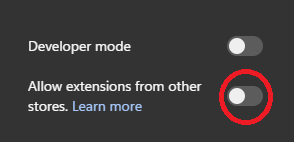

## Usage

The Damage Calculator Plus icon can be found next to the original Damage Calculator.

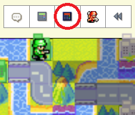

Once opened, Damage Calculator Plus functions much like the original calculator, with several additional features.

### HP

Unit HP is displayed as a value from **1–100**. Changing the HP updates the number displayed in the bottom-right corner of the unit.

The displayed value is the unit's HP divided by 10 and rounded up. For example, a unit with **1–10 HP** displays **1**, **11–20 HP** displays **2**, and so on.

This displayed HP value affects the unit's attack power, luck rolls, and terrain defense bonuses.


### Damage Values

COs with negative luck modifiers can roll damage values below zero. While attacks can never deal negative damage, these negative rolls still affect the average damage dealt.

In the example below, it appears that Flak deals an average of **(0 + 90) / 2 = 45%** damage. This is misleading because the original Damage Calculator hides negative damage rolls.

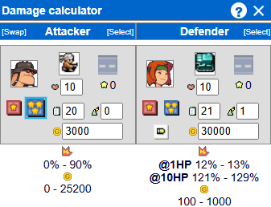

Damage Calculator Plus displays negative damage rolls in red. Here, the true average is **(-37 + 90) / 2 = 26.5%** damage.

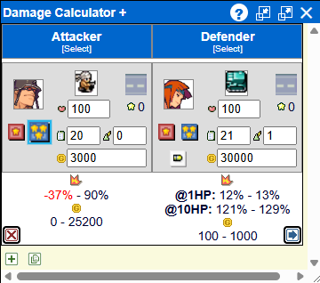

### Add Button


The Add Button appears in the bottom-right corner whenever the defender has a chance to survive the attack.

When a follow-up calculation is added, the defender from the current calculation is carried over automatically. By default, the defender is assumed to have taken the minimum possible damage from the previous attack.

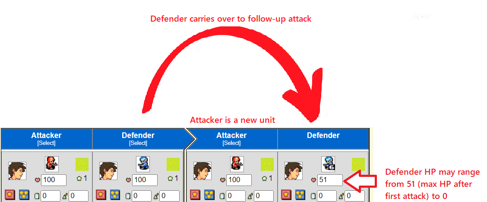

Multiple future outcomes can be examined simultaneously. Each click of the Add Button adds another follow-up attack.

In the example below, **Tank → Mech** guarantees a kill, while **Tank → Infantry** does not.

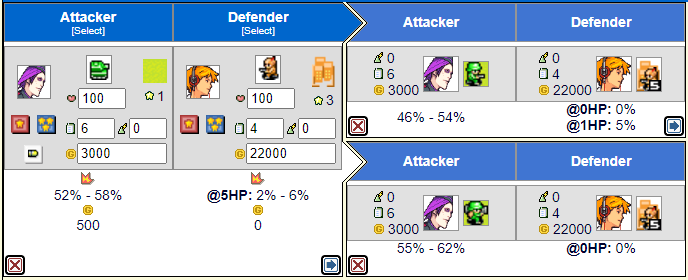

### Delete Button


The Delete Button is located in the bottom-left corner. Pressing it deletes the selected calculation and all of its follow-up attacks.

### New Calc Button


The New Calc Button is located in the bottom-left corner and allows you to compare different attack sequences.

In the example below, Max has his SCOP ready and an Anti-Air eight spaces away from the Bomber.

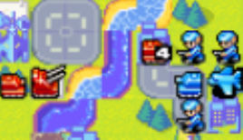

By sacrificing the 4 HP Tank, it's possible to destroy the enemy Tank. While it may seem natural to activate the SCOP immediately, notice that with the SCOP active, the enemy Tank has a chance to **fail** to destroy the 4 HP Tank. If Max sacrifices the 4 HP Tank first and then activates the SCOP, the kill is guaranteed.

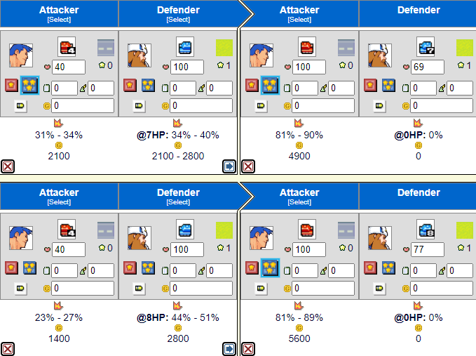

### Copy Calc Button


The Copy Calc Button copies the calculation currently displayed in the original Damage Calculator into Damage Calculator Plus.

### Focusing

Clicking the header of a calculation minimizes it along with all of its follow-up attacks. The minimized calculation displays a compact summary that takes up less space.

Minimized calculations continue to update if an earlier calculation changes. Clicking a minimized calculation restores it to full size.

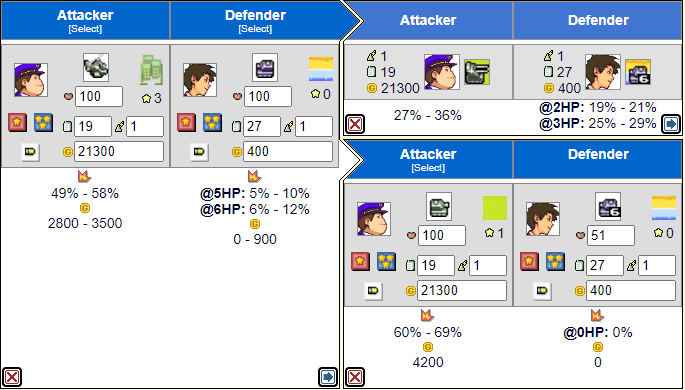

### Invalid Calculations

Sometimes, changing one calculation can make later calculations impossible.

Initially, the follow-up attack is valid because the defender always survives the first attack.

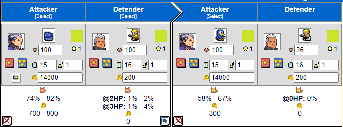

After changing the first attacker to an Anti-Air, the follow-up attack becomes invalid because the defender is always destroyed.

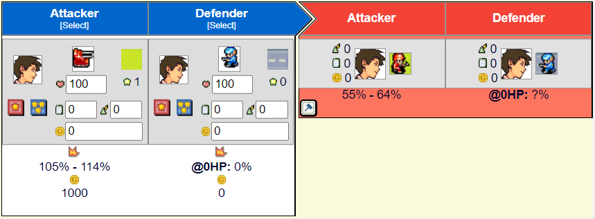

Invalid calculations can either be deleted to save space or left in place.

## Special Modes

Only one Special Mode can be enabled at a time. Both are disabled by default.

### Luck Mode

Luck Mode displays a slider that lets you select the luck roll for an attack. Below the slider are the probability of rolling that value, the resulting attack damage, and the displayed damage percentage.

To enable Luck Mode, click the toggle in the header. The slider is visible when Luck Mode is enabled (  ) and hidden when it is disabled (  ).

Most COs have a luck range of **0 to 9**, meaning each luck value is equally likely. As a result, the maximum luck roll occurs **10%** of the time.

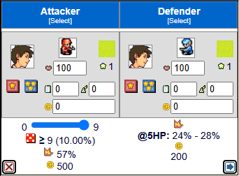

Sonja, for example, has both good luck (**0 to 9**) and bad luck (**0 to -9**). Because both components are rolled independently, the maximum possible luck roll occurs only when the good luck roll is **9** and the bad luck roll is **0**, giving it a probability of just **1%**.

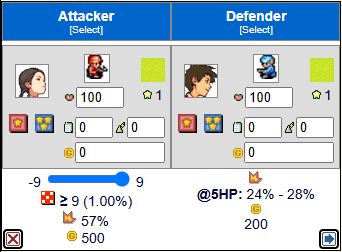

### Lookup Mode

Lookup Mode displays a slider that lets you select the defender's remaining HP after a sequence of attacks. Below the slider is the probability that the defender ends with that amount of HP after all attacks have been resolved.

To enable Lookup Mode, click the toggle in the header. The slider is visible when Lookup Mode is enabled (  ) and hidden when it is disabled (  ).

With one Com Tower, two Infantry have a **31%** chance of defeating an Infantry on a city.

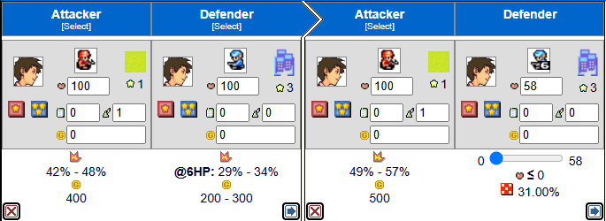

With two Com Towers, the KO is **100%** guaranteed.

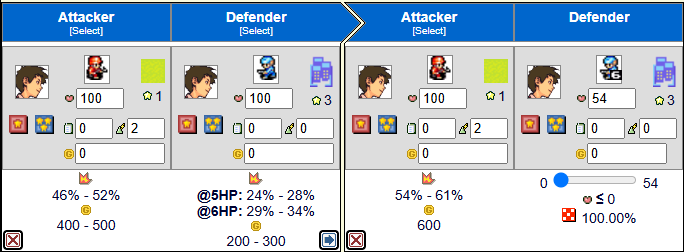

## Dev Settings
Dev settings and experimental features can be accessed by using the Dev Settings shortcut. Use  to access the Dev Settings. Toggle buttons for the experimental features will appear at the top of the calculator.

### Safe Mode
By default, changes to the defender or attackers that break game logic are not allowed. An alternate cursor will be used when hovering over an attribute that may not be altered.
All attributes of the first attack may be changed.

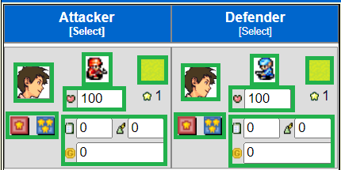

All changes made in the past will update future attacks. Changes that would be possible (Green) are allowed (e.g. Defender loses a Comm Tower or Attacker gains a Comm Tower).
Changes that would contradict something in the past (Red) are not allowed (e.g. Defender terrain changes in the middle of Attacker's turn).
Once a COP or SCOP has been activated, all future attacks must also have it activated.

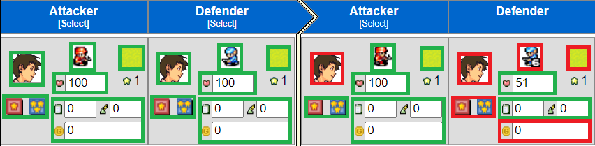

If you would like to make an invalid change, you can turn off Safe Mode in two easy steps.

First, use the Dev Setting shortcut to access the Safe Mode toggle button.

Then, simply toggle Safe Mode on or off as you desire. Invalid inputs are locked when Safe Mode is on (  ) and can be changed when Safe Mode is off (  ).

When the Safe Mode Toggle is not visible, Safe Mode is always on.
Be careful when using the calculator with Safe Mode off as illogical or unreliable results are possible.

### Clear Session Data
Damage Calculator Plus uses session storage to save the calculator state. Anytime the attacker, defender, or calc settings are changed the session data is updated. Session data will be cleared when the browser is closed. 

If you would like to clear data without closing the browser, use the Dev Settings shortcut to access the Clear Session Data button (  ).

Refreshing the page after clearing session data will revert to the default calc.

## Bugs
Please feel free to report bugs and/or suggest improvements or new features!

**Send bug reports to:** awbw.damage.calculator.plus@gmail.com

Please include the following information:

```
Issue:

Steps to reproduce:
1.
2.
3.

Expected result:

Actual result:

URL:

Browser:

Calc Plus Version (Hover over the ?):
```