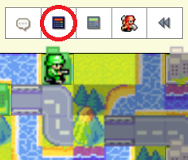
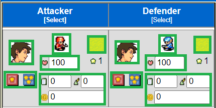
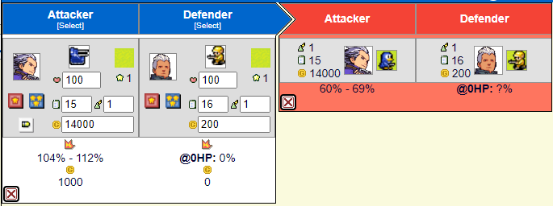

# AWBW Damage Calculator Plus

## Table of Contents
1. [Introduction](#introduction)
2. [Installation](#installation)
3. [Usage](#usage)
4. [Error Reporting](#error_reporting)

## Introduction
AWBW Damage Calculator Plus is a web extension that expands the functionality of the regular damage calculator by allowing calculation of sequential attacks. 
Functionality and availability of the original Damage Calculator is unchanged.

## Installation
The extension is currently available for Chrome on the Chrome web store.

## Usage
The icon can be found next to the original Damage Calculator.

Once the calculator is open, it functions the same as the original with a few key differences.

### HP
Unit HP is displayed as a value from 1-100. Changes to the HP effect the number displayed at the bottom right corner of the unit. 
The value displayed is the unit's HP divided by 10 and rounded up. A unit with 1-10 HP will display 1, 11-20 will display 2, ect.
The display value effects the unit's attack power and defense bonuses from terrain.

### Add Button
The Add Button will appear in the bottom right corner if the defender has a chance to be alive after the attacker fires.

When a new calculation is added, the defender of the current calculation will be carried over. 
The defender's health must be below the maximum health available after taking the previous attack but may go lower than the minimum health in some circumstances (e.g. a global damage SCOP was used).

All attributes of the first attack may be changed.

All changes made in the past will update future attacks. Changes that would be possible (Green) are allowed (e.g. Defender loses a Comm Tower or Attacker gains a Comm Tower).
Changes that would contradict something in the past (Red) are not allowed (e.g. Defender terrain changes in the middle of Attacker's turn).
Once a COP or SCOP has been activated, all future attacks must also have it activated.

Multiple future outcomes can be examined at once. Each click of the Add Button adds a follow-up attack.
In this example, tank + mech garuntees a kill whereas tank + infantry doesn't.

### Delete Button
The Delete Button is located in the bottom left corner. Pressing this button will delete the calculation and any follow-up attacks that occur after.

### Focusing
Clicking on the top of a calculation will minimize it and all follow-up attacks from that calculation. The minimized calc will show a summary that takes up less space.
Minimized calculations will update if a previous calculation is changed. Clicking a minimized calculation will return it to full size.

### Invalid Calculations
Sometimes, a change to one calculation will make future ones invalid. 

Initially, the follow-up attack is valid because the Defender will always survive.

After changing the unit used in the first attack to an Anti-Air, the follow-up attack becomes invalid since the Defender will always be killed.

Invalid calculations can be deleted to save space or left alone.

## Error Reporting {error_reporting}
Report errors [here](https://forms.gle/my2XMuUk14ZDjry46).
Feel free to contribute! this is my first JS project an I could definately use some help.
